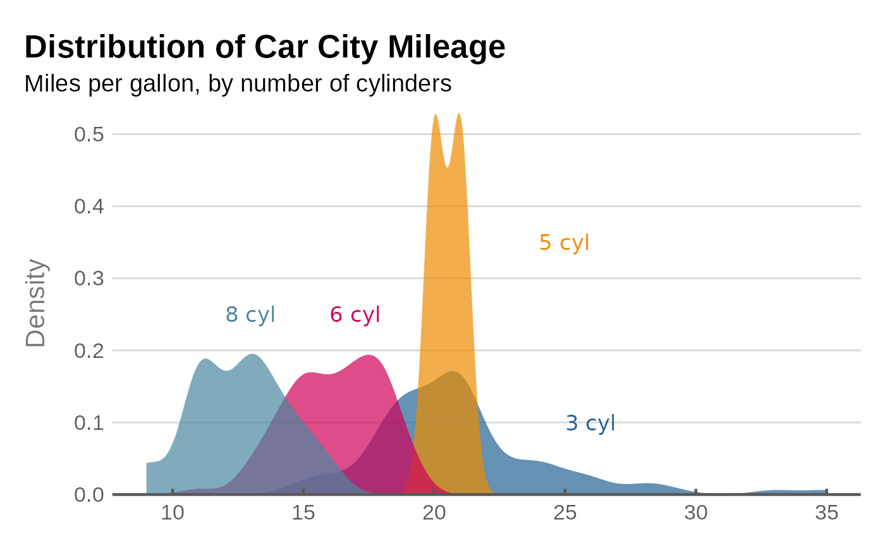
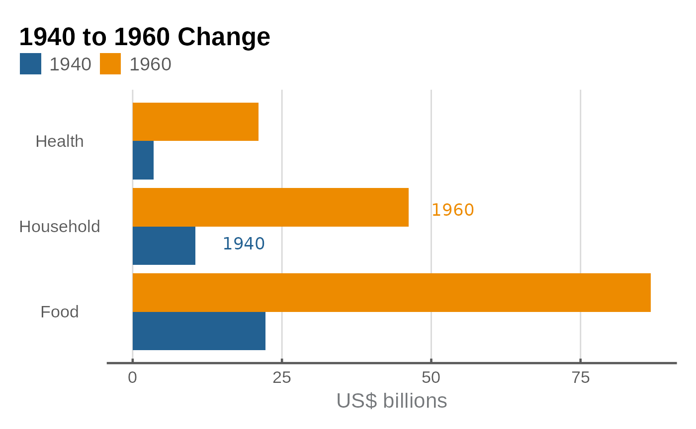

# Introduction to esctheme

## Introduction

`esctheme` is the Essential Services Commission of Victoria graphing
package for producing graphs that abide by our charts standards. It
works by changing the appearance and functionality of charts produced
using the `ggplot2` package.

You should read this article to help you understand how to create charts
following our chart standards.

This article provides some examples to help you figure out what elements
you can change. The function documentation provides comprehensive
information on the full customisation of the package.

## Correct workflow

When making graphs, you should follow the below workflow.

Save your graph using
[`esc_save()`](https://esc-economics.github.io/esctheme/reference/esc_save.md).
Do **not** use the Export button in the Plots tab or `ggsave()`.

Start by creating a graph using the ‘normal’ stuff:
`ggplot(data, aes(x, y)) + geom_blah()`. Then:

- Add plot labelling:
  [`plot_label()`](https://esc-economics.github.io/esctheme/reference/plot_label.md)
- Use
  [`esc_theme()`](https://esc-economics.github.io/esctheme/reference/esc_theme.md)
  at the end of your plot code.
- Save the graph:
  [`esc_save()`](https://esc-economics.github.io/esctheme/reference/esc_save.md).

## The colour palette

This is the Essential Services Commission colour palette.

All the colours are package objects that can be selected by using the
appropriate name. For example, `esc_magenta` selects the colour
‘Magenta’ with nine shades starting from the base shade in column ‘0’.


The `esc_palette` function provides you with `n` base colours in coloumn
‘0’ plus three additional secondary colours.

## Graph examples

### Line graph

``` r
g <- ggplot(data_3, aes(x = year, y = value, colour = category)) + 
  geom_line(linewidth = 1, show.legend = FALSE) +
  scale_colour_manual(values = esc_palette(3)) +
  plot_label(c("Food and\nTobacco", "Household\nOperation", "Medical and\nHealth"),
              c(1944, 1954, 1953),
              c(65, 55, 25),
             colour = esc_palette(3)
             ) +
  labs(
    title = "US Personal Expenditures*",
    subtitle = "1940-1960",
    caption = "* Data comes from the built-in US Personal Expenditure dataset."
  ) +
  ylab("US$ billions") +
  esc_theme(rm_x_leg = TRUE)
```


### Column graph

``` r
g <- ggplot(data_3, aes(x = year, y = value, fill = category)) + 
  geom_col(position = "dodge", show.legend = FALSE, colour = "black") +
  scale_y_continuous(expand = expansion(mult = c(0,.2))) +
  scale_fill_manual(values = esc_palette(3)) +
  plot_label(c("Food and\nTobacco", "Household\nOperation", "Medical and\nHealth"),
              c(1936, 1943, 1950),
              c(85, 85, 85),
             colour = esc_palette(3)) +
  labs(
    title = "US Personal Expenditures*",
    subtitle = "1940-1960",
    caption = "* Data comes from the built-in USPersonalExpenditure dataset."
  ) +
  ylab("US$ billions") +
  esc_theme(rm_x_leg = TRUE)
```


### Scatter graph

``` r

# Set up data
mtcars2 <- within(mtcars, {
  vs <- factor(vs, labels = c("V-shaped", "Straight"))
  am <- factor(am, labels = c("Automatic", "Manual"))
  cyl  <- factor(cyl)
  gear <- factor(gear)
})

# Graph
g <- ggplot(mtcars2, aes(x = wt, y = mpg, colour = gear)) +
  geom_point(size = 4, show.legend = FALSE) +
  scale_colour_manual(values = esc_palette(3)) +
  plot_label(
    label = c("3 cyl", "4 cyl", "5 cyl"),
    x = c(4, 2.7, 2.5),
    y = c(23, 35, 15),
    colour = esc_palette(3),
    size = 4.5
  ) +
  labs(
    title = "Car Fuel Efficiency and Weight",
    subtitle = "Data from 1973-74"
  ) +
  xlab("Weight (1000 lbs)") +
  ylab("Miles per gallon") +
  esc_theme()
```


### Faceted scatter graph

``` r
g <- ggplot(mtcars2, aes(x = wt, y = mpg)) +
  facet_wrap(~vs, scale = "free_x") +
  geom_point(size = 4, colour = esc_magenta[1], alpha = .7) +
  scale_y_continuous(limits = c(0, 40), breaks = seq(0,40, 12)) +
  labs(
    title = "Car Fuel Efficiency and Weight",
    subtitle = "Data from 1973-74"
  ) +
  xlab("Weight (1000 lbs)") +
  ylab("Miles per gallon") +
  esc_theme()
```


### Density graph

``` r
g <- ggplot(mpg, aes(x = cty, fill = factor(cyl))) + 
  geom_density(linetype = "blank", alpha = 0.7, show.legend = FALSE) +
  scale_fill_manual(values = esc_palette(4)) +
  scale_y_continuous(expand = 0) +
  
  labs(
    title = "Distribution of Car City Mileage",
    subtitle = "Miles per gallon, by number of cylinders"
  ) +
  plot_label(label = c("3 cyl", "5 cyl", "6 cyl", "8 cyl"),
              x = c(25, 24, 16, 12),
              y = c(0.1, 0.35, 0.25, 0.25),
             size = 4.5,
             colour = esc_palette(4)) +
  ylab("Density") +
  esc_theme(rm_x_leg = TRUE)
```



### Horizontal bar graph

There are a few reasons to work with horizontal bars, some are:

- Long category labels to improve readability.
- Multiple categories
- Data ordering

Horizontal bar graphs made with `coord_flip()` require some changes to
the `theme()` in order to look proper. `format_flip` wraps those changes
up in a convenient function that should be appended at the end of the
graph code, after theming functions such as
[`esc_theme()`](https://esc-economics.github.io/esctheme/reference/esc_theme.md)
have been called.

``` r
g <- ggplot(data_col, aes(x = category, y = value, fill = factor(year))) +
  geom_col(position = "dodge") +
  coord_flip() +
  scale_fill_manual(values = esc_palette(2)) +
  plot_label(c("1940", "1960"),
              c(1.8, 2.2),
              c(15, 50),
             size = 4.5,
             colour = esc_palette(2)) +
  labs(
    title = "1940 to 1960 Change"
  ) +
  ylab("US$ billions") +
  esc_theme(rm_y_leg = TRUE) +
  format_flip()
```


